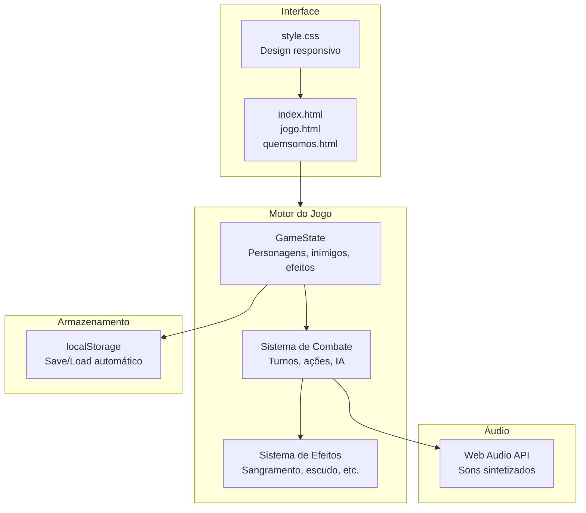

<p align="center">
  
</p>

<h1 align="center">RPG Turnos</h1>

<p align="center">
  <em>Um RPG de turnos onde estratégias e habilidades decidem o destino da batalha.</em>
</p>

<p align="center">
  
  
  
  
  
</p>

<p align="center">
  <a href="#preview">Preview</a> ·
  <a href="#features">Features</a> ·
  <a href="#how-to-play">Como Jogar</a> ·
  <a href="#characters">Personagens</a> ·
  <a href="#effects">Sistema de Efeitos</a> ·
  <a href="#architecture">Arquitetura</a> ·
  <a href="#tech-stack">Tech Stack</a>
</p>

---

## How to Play

### 1. Inicie a jornada

Acesse o site e clique em **"Iniciar sua jornada"**.

### 2. Escolha seu personagem

| Guerreiro | Mago |
|:---:|:---:|
| ❤️ Alta vida (120 HP) | ⚔️ Alta força (18 ATK) |
| ⚔️ Baixa força (12 ATK) | ❤️ Baixa vida (80 HP) |
| 🛡️ Foco em sobrevivência | 🔥 Foco em dano mágico |

### 3. Domine o sistema de turnos

Cada turno, você escolhe entre:

| Ação | Efeito |
|---|---|
| **Atacar** | Dano base igual ao seu ATK |
| **Curar** | Recupera 15 HP (máximo = vida máxima) |
| **Skills** | Habilidades especiais com efeitos únicos |

### 4. Gerencie seus efeitos

| Efeito | Tipo | Duração | Efeito |
|---|---|---|---|
| 🩸 Sangramento | Inimigo | 3 turnos | 8 dano/turno |
| 🔥 Queimadura | Inimigo | 3 turnos | 8 dano/turno |
| 😵 Atordoamento | Inimigo | 1 turno | Inimigo perde turno |
| 🛡️ Escudo | Jogador | 1 ataque | Bloqueia dano |
| 🗡️ Aparo | Jogador | 3 turnos | Reflete 50% do dano |
| 💨 Esquiva | Jogador | 3 turnos | 35% chance de evitar |

### 5. Escolha sua recompensa

Após derrotar o Goblin:

| Recompensa | Efeito |
|---|---|
| ⚔️ **+4 ATK** | Seu ataque aumenta permanentemente |
| ❤️ **+40 HP** | Recupera 40 vida (máximo = vida máxima) |
| ✨ **Habilidade Nova** | Desbloqueia a skill secreta do seu personagem |

### 6. Enfrente o Chefe

O Chefe Goblin tem mais vida (140 HP) e força (16 ATK) — use tudo que aprendeu!

## Characters

### Guerreiro

> *"O ferro não perdoa, mas quem o empunha pode escolher."*

| Habilidade | Efeito |
|---|---|
| **Golpe Dilacerante** | 25 dano + sangramento (3 turnos) |
| **Dança Ágil** | Esquiva por 3 turnos (35% chance) |
| **Posição de Aparo** | Reflete 50% do dano recebido (3 turnos) |

### Mago

> *"O fogo obedece a quem o compreende."*

| Habilidade | Efeito |
|---|---|
| **Bola de Fogo** | 25 dano + queimadura (3 turnos) |
| **Escudo Mágico** | Bloqueia o próximo ataque |
| **Raio Eletrizante** | 30 dano + atordoamento (1 turno) |

## Effects

O sistema de efeitos adiciona profundidade estratégica:

```
Turno do Jogador          Turno do Inimigo
     │                          │
     ├── Atacar ────────────────┤
     │   └── Aplica dano        │
     │                          ├── Processa efeitos
     ├── Skill ─────────────────┤   ├── Sangramento (8 dano)
     │   ├── Golpe Dilacerante  │   ├── Queimadura (8 dano)
     │   ├── Bola de Fogo       │   └── Atordoamento (perde turno)
     │   └── Raio Eletrizante   │
     │                          ├── IA decide ação
     ├── Curar ─────────────────┤   ├── Atacar (65%)
     │   └── +15 HP             │   └── Curar (35%)
     │                          │
     └── Processar efeitos ─────┘
         ├── Dodge (35% esquiva)
         ├── Shield (bloqueia)
         └── Parry (reflete 50%)
```

## Architecture



### Estrutura de Pastas

```
├── index.html          # Página inicial — banner, sobre, CTA
├── jogo.html           # Tela principal — seleção + combate
├── quemsomos.html      # Página do desenvolvedor
├── style.css           # Estilos — variáveis, responsivo, acessibilidade
├── script.js           # Motor do jogo — 5 módulos principais
│   ├── GameState       # Estado central do jogo
│   ├── Characters      # Definições de personagens e inimigos
│   ├── AudioManager    # Sintetizador de áudio via Web Audio API
│   ├── SaveSystem      # Persistência em localStorage
│   └── Combat          # Lógica de turnos, efeitos e IA
└── imagens/            # Assets visuais
    ├── guerreiro.png
    ├── mago.png
    ├── goblin.png
    ├── boss.png
    └── ...             # Ícones de efeitos e UI
```

## Tech Stack

| Camada | Tecnologia |
|---|---|
| **Markup** | HTML5 semântico com ARIA |
| **Estilo** | CSS3 com variáveis, flexbox e media queries |
| **Lógica** | JavaScript ES6+ (módulos, classes, arrow functions) |
| **Áudio** | Web Audio API (osciladores e ganho) |
| **Armazenamento** | localStorage (JSON serialization) |
| **Acessibilidade** | WAI-ARIA, focus management, reduced motion |
| **Fonte** | Press Start 2P (Google Fonts) |

## Responsividade

| Breakpoint | Comportamento |
|---|---|
| `> 1200px` | Layout completo, todos os elementos visíveis |
| `992px - 1200px` | Cards menores, inimigo reduzido |
| `768px - 992px` | Layout em coluna, ações centralizadas |
| `480px - 768px` | Interface compacta, botões maiores |
| `< 480px` | Modo mobile completo, fontes escaláveis |

## Contribuindo

Este é um projeto educacional. Contribuições são bem-vindas!

1. Fork o projeto
2. Crie uma branch (`git checkout -b feature/nova-feature`)
3. Commit suas mudanças (`git commit -m 'feat: adiciona nova feature'`)
4. Push para a branch (`git push origin feature/nova-feature`)
5. Abra um Pull Request

## Autor

**Rafael Magalhães Barreto**
- 📧 nectar.rafael@gmail.com
- 🎓 RA: 74126009-5

## Licença

Projeto educacional — FECAP

---

<p align="center">
  <sub>Feito com 💚 por Rafael Magalhães Barreto</sub>
</p>
